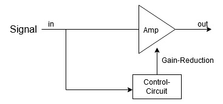
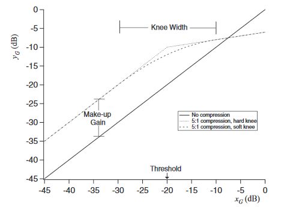
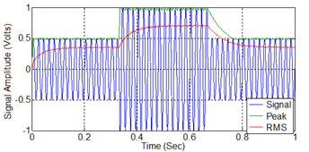

<!-- omit in toc -->
# CTAG Dynamic Range Compressor
<!-- omit in toc -->
## An audio compressor plugin created with [JUCE](https://juce.com/)

<!-- omit in toc -->
## Contents
- [Introduction](#introduction)
- [Features](#features)
- [Manual](#manual)
    - [General](#general)
    - [Gain Computer](#gain-computer)
    - [Ballistics](#ballistics)
    - [Parameter Automation](#parameter-automation)
    - [Metering](#metering)
- [Technical](#technical)
  - [Design Approach](#design-approach)
  - [Overview](#overview)
    - [Level Detection](#level-detection)
    - [Log and Lin Conversion](#log-and-lin-conversion)
    - [Gain Computer](#gain-computer-1)
    - [Ballistics](#ballistics-1)
    - [Parameter Automation](#parameter-automation-1)
      - [Automating the time constants](#automating-the-time-constants)
      - [Automating the makeup gain](#automating-the-makeup-gain)
    - [LookAhead](#lookahead)
- [References](#references)
 
## Introduction
This is a simple vst3/au compressor plugin that was build with the goal in mind to create a good sounding compressor for a wide variety of signals and applications. The GUI is kept minimalistic to improve usability and not clutter the screen.
The project was mostly used to further my understanding and knowledge of digital signal processing and digital audio effects.[A demonstration is available on YouTube.](https://www.youtube.com/watch?v=ZFKPXIpGRq8)

## Features
- Input Gain
- Threshold/Ratio/Knee
- Attack/Release
- Auto Attack/Release
- Makeup
- Auto Makeup
- Mix
- LookAHead
- Metering (Input/Output/Gain Reduction)
 
## Manual
#### General
- **Input:** The Input knob adjusts the level of the signal before any processing happens. Driving the input signal harder into the compressor can be used as an alternative to lowering the threshold.
- **Makeup:** The Makeup knob adjusts the level of the output signal after the compression was applied. Generally speaking, compression lowers the output level of a signal by design. This lets you compensate for any loss or gain in volume.
- **Mix:** The Mix knob enables you to mix between the dry and processed signal. This can be used for parallel processing and enables use-cases like NY-Style drum compression. 
- **LookAhead:** The LookAhead button enables the LookAhead-Mode. If the compressor is used as a limiter (Ratio infinity:1 & instant attack time) it will anticipate the incoming peaks and fade in the aggressive gain reductions, thus preventing distortion from happening.
  
#### Gain Computer
- **Threshold:** The Threshold knob adjusts the level above which the compressor starts attenuating the input signal. The Input knob alternatively can be used to drive the signal harder into the compressor, resulting in a less low threshold being needed. Be careful to not drive the signal too hard or it'll start clipping.
- **Ratio:** The Ratio knob determines how much the signal is attenuated above the chosen threshold. For a ratio of 4:1, one dB remains for every 4dB of input signal above the threshold. At a ratio of 1:1 no compression is happening, as the input is exactly the output. At a ratio of inifinity:1 (knob all the way to the right) the compressor is acting as a limiter, meaning that everything above the treshold is completely compressed away.
- **Knee:** The Knee knob is used to achieve a rounder compression curve. Having a *hard knee* (knob all the way to the left) means that the compressor will only start working if the input signal is above the threshold and will stop working immediately when it is below. Using a *soft knee* on the other hand will define a range *(knee/2)* above and under the threshold, where the compressor will slowly start or stop compressing, resulting in a more gradual and transparent compression.

#### Ballistics
- **Attack:** The Attack knob sets the time that determines how fast the compression will set in once the signal exceeds the threshold. Generally speaking you want a rather fast attack time for transient-rich signals like drums to minimize overshoot. 
- **Release:** The Release knob sets the time that determines how fast the compressor will recover from the gain reduction once the signal falls under the threshold. Depending on the input signal, short release times may introduce a "pumping" effect and/or distortion.
  
#### Parameter Automation
- **Auto Makeup:** The AutoMakeup button enables automatic makeup gain. Based on the average attentuations applied to the input signal. This features tries to keep the input signal and the processed output signal as close as possible in perceived loudness. This is a time-varying effect and may introduce unwanted volume changes to the output signal.
- **Auto Attack & Auto Release:** The AutoAttack and AutoRelease buttons enable/disable the automation of the time constants. Based on the ratio of peak and rms level of the input signal the compressor can make assumptions about the "transient-richness" of the signal and automate the ballistics accordingly.

#### Metering
- **Gainreduction:** This is a simple gainreduction meter. Right-most indicator is 0dB gainreduction and therefore no compression. The left-most indicator is -30dB, middle indicator -15dB. 
- **Input/Output:** The Input/Output meter is a "VU-Style" peak meter. Right-most indicator 0dBFS. Left-most indicator -50dBFS.

## Technical

### Design Approach
In general there are two topologies for compressor design:
- Feedback - Topology
- Feedforward - Topology

Most modern compressors use a feedforward topology due to limitations of the feedback topology such as the inability to allow a lookahead functionality aswell as to work as a limiter due to inifnite negative amplification needed. 

Therefore the topology of choice is the feedforward topology

The control circuit is fed with a copy of the input signal and calculates the needed attenuations which are then multiplied with the input signal. 
One might recognize this diagram since it pretty much resembles an analog VCA-Compressor. In a VCA-Compressor the voltage controlled amplifier attenuates a signal according to an external control voltage coming from the control circuit.

### Overview
Knowing that we are building "the ideal VCA-Compressor" the interesting question is how the control voltage is actually calculated in a digital implementation.

A basic compressor diagram:

Lets take a look at the components.

#### Level Detection
Two approaches - *peak detection* which is based on the absolute value of the signal and *rms detection* which is based on the square of the signal.
Both are easily implemented in the digital domain, but rms detection introduces a significant delay, therefore peak detection was the choice for this implementation.

In C++ this is as simple as doing:

`float input = std::abs(sample)`

#### Log and Lin Conversion
One of the reason many compressors sound different. Calculation of attenuations and smoothing can be done either in linear or log. domain.

Converting from linear to log (decibel):

`float log = 20 * std::log10 (gain)`

and converting from log. to linear:

`float lin = std::pow (10.0, decibels * 0.05)`

In this implementation the gain computer as well as the ballistics are operating in the log. domain.

#### Gain Computer

The gain computer calculates how much the input signal needs to be attenuated given the current chosen characteristics. It also generates the control voltage which is used to attenuate the signal in the gain stage.

A typical compression curve looks like:

The *Treshold*, *Ratio* and *Knee* parameters define the input/output characteristics of the compressor. 

If we ignore the knee parameter for now, the compressor starts to attenuate the signal according to the ratio once it exceeds the threshold. 

Resulting in:

With *xG* being the input, *yG* the output, *T* the threshold and *R* the ratio.

In order to soften the compression we can smooth the transition between no compression and compression. This is called *soft knee*. The knee knob adjusts the dB-range which is equally distributed on both sides of the threshold. 

To implement this we can replace the equation above with a second order interpolation function [[1]]:

With *W* being the knee-width and *(xG - T)* being the overshoot. When *W* is set to 0dB this function is identical to the *hard knee*.

A simplified implementation:

    float applyCompression(const float& input)
    {
        const float kneeHalf = knee/2.0;
        const float overshoot = input - threshold;

        if (overshoot <= -kneeHalf)
            return 0.0f;
        if (overshoot > -kneeHalf && overshoot <= kneeHalf)
            return 0.5f * slope * square(overshoot + kneeHalf) / knee;

        return slope * overshoot;
    }

This function returns the calculated attenuations which are then being fed into the smoothing filter aka. *peak detector*.

#### Ballistics
The time constants are another component that differs alot from compressor to compressor. The attack is usually defined as the time it takes for the compressor to attenuate the signal once the signal exceeds the threshold. Likewise release is defined as the time it takes for the compressor to recover once the signal falls under the threshold.

In a digital implementation the attack and release times are usually introduced through a digital one-pole filter, also known as smoothing filter. 

Where *r[n]* is the input, *s[n]* the output and *alpha* the filter coefficient. With the step response:

The attack/release coefficients are then calculated as follows:

This is true when the rise time of the step response is considered to go from 0% to 63% or 1 - 1/e of the final value.
Meaning, tauAttack starts at 0 and goes to 1. Therefore attack time is the time it takes for the level to reach 0.63.
TauRelease starts at 1 and goes to 0. The release time is the time it takes for the level to reach 1-0.63 = 0.37.
[[2]]

Someone else might consider the rise time of the step response to go from 10% to 90% of the final value or define it as time to change level by so many dBs.

Improved designs are proposed in [[1]] and [[2]].

Smooth branching peak detector:

C++ implementation:

    float processPeakBranched(const float& in)
    {
        //Smooth branched peak detector
        if (in < state01)
            state01 = alphaAttack * state01 + (1 - alphaAttack) * in;
        else
            state01 = alphaRelease * state01 + (1 - alphaRelease) * in;

        return static_cast<float>(state01); //yL
    }

Smooth decoupled peak detector:

C++ implementation:

    float processPeakDecoupled(const float& in)
    {
        //Smooth decoupled peak detector
        const double input = static_cast<double>(in);
        state02 = jmax(input, alphaRelease * state02 + (1 - alphaRelease) * input);
        state01 = alphaAttack * state01 + (1 - alphaAttack) * state02;
        return static_cast<float>(state01); //yL
    }

The definition of the time constants, design of smoothing filter and the placement of the filter are all variables that change the sound of the compressor.

For this implementation the smooth branching peak detector was placed behind the gain computer to smooth the calculated attenuations. Due to the placement, the detector does not have to operate on the whole dynamic range of the input signal.

#### Parameter Automation

The sidechain configuration including components for parameter automation and look-ahead.

##### Automating the time constants
The attack and release times can be automated using the crest factor of the input signal. The crest factor is defined as the ratio of peak signal level to root means squared (rms) signal level over a given duration.

This method is a useful short term signal measure to determine the nature of a signal. For a *steady-state* signal the rms value will be close to the peak value, therefore the crest factor will be relatively small. 

The ideal time frame for the measurement was informally evaluated in [[4]] and chosen to be 200ms. Choosing the same time frame for both the peak and the rms detector ensures that the rms value will always be smaller than the peak value.

Since most transients in a signal are a burst of high amplitude over a short duration (typically < 10ms) the contribution to the rms value is relatively small in comparison to the peak value. This means, the crest factor will be high for *transient-rich* signals and small for *steady-state* signals.

As shown in [[4]] we can combine a peak and rms detector as follows:

And then calculate the time constants like:

Implemented in C++ this could look like:

    //Init accumulators
    if (!peakState) peakState = src[0];
    if (!rmsState) rmsState = src[0];

    //Calculate crest factor and ballistics
    for (int i = 0; i < numSamples; ++i)
    {

        //Square of input signal
        const double s = static_cast<double>(src[i])* static_cast<double>(src[i]);

        //Update peak state
        peakState = jmax(s, a1 * peakState + b1 * s);

        //Update rms state
        rmsState = a1 * rmsState + b1 * s;

        //calculate squared crest factor
        const double c = peakState / rmsState;
        cFactor = c > 0.0 ? c : 0.0;

         //calculate ballistics
        if (cFactor > 0.0)
        {
            attackTimeInSeconds = 2 * (maxAttackTime / cFactor);
            releaseTimeInSeconds = 2 * (maxReleaseTime / cFactor) - attackTimeInSeconds;
        }
    }

##### Automating the makeup gain
The makeup gain automation in this implementation is not ideal. It is based on the calculated attenuations smoothed over a long time frame, then added back to the compressed signal to achieve ouput volume that is closer to the perceived loudness of the input signal. Since added makeup gain is a smoothed over a time frame, it is still time-varying and therefore changes the gain over time. This should rather be an approximation to get closer to the perceived loudness of the input signal, thus a static gain increase.

In [[3]] aswell as in [[4]] ideas are discussed on how to tackle this problem.

#### LookAhead
LookAhead is mostly used in limiters, meaning, compressors with a ratio of infinity:1 and instantanious attack. LookAhead, like the name already suggests, looks ahead and anticipates incoming peaks. 

It is used to lower/prevent distortion that occurs when the gain reduction happens too fast. This might be very noticeable when the signal has low frequency content and the attack time is faster than a single cycle of the waveform.

Most books and articles on the internet implement this feature by simply delaying the input signal. This means that the calculated attenuations will affect the signal a chosen time (mostly 5ms-15ms) before the transient will effectively hit the compressor. 
So - what will happen if an incoming peak is shorter than the chosen time? 

The limiter will most likely miss it and even if the release time is considerably long the peak won't be attenuated by the correct amount.

A different approach - 
In the article [[5]] a different implementation is proposed by Daniel Rudrich. We delay the input signal aswell as the calculated attenuations. Then use the delay time to fade in the aggressive gain reduction happening when a peak occurs. Instead of instantly going to the final value of the needed attenuation, we use the 5-15ms time frame to ramp towards that value, thus effecively preventing distortion.

**Comparing the two implementations**

Only delaying the input signal:

Fading in the aggressive gain reductions:

It's quite visible that in the first figure the peak isn't completely attenuated and the gain reduction kicks in abruptly. This will result in an audible click and distortion.

In the second figure the gain reduction is faded in slowly, thus preventing any of the unwanted effects.

## References
- (1) https://www.eecs.qmul.ac.uk/~josh/documents/2012/GiannoulisMassbergReiss-dynamicrangecompression-JAES2012.pdf
- (2) http://c4dm.eecs.qmul.ac.uk/audioengineering/compressors/documents/Reiss-Tutorialondynamicrangecompression.pdf
- (3) http://c4dm.eecs.qmul.ac.uk/audioengineering/compressors/documents/Giannoulis.pdf
- (4) http://www.eecs.qmul.ac.uk/~josh/documents/2013/Giannoulis%20Massberg%20Reiss%20-%20dynamic%20range%20compression%20automation%20-%20JAES%202013.pdf
- (5) https://github.com/DanielRudrich/SimpleCompressor/blob/master/docs/lookAheadLimiter.md

[1]: https://www.eecs.qmul.ac.uk/~josh/documents/2012/GiannoulisMassbergReiss-dynamicrangecompression-JAES2012.pdf
[2]: http://c4dm.eecs.qmul.ac.uk/audioengineering/compressors/documents/Reiss-Tutorialondynamicrangecompression.pdf
[3]: http://c4dm.eecs.qmul.ac.uk/audioengineering/compressors/documents/Giannoulis.pdf
[4]: http://www.eecs.qmul.ac.uk/~josh/documents/2013/Giannoulis%20Massberg%20Reiss%20-%20dynamic%20range%20compression%20automation%20-%20JAES%202013.pdf
[5]: https://github.com/DanielRudrich/SimpleCompressor/blob/master/docs/lookAheadLimiter.md
